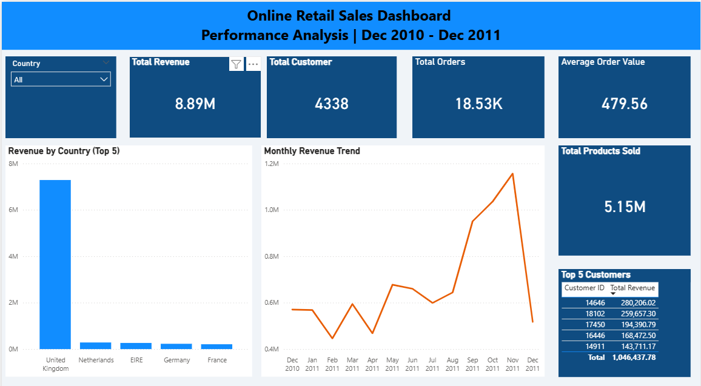

# 🛒 Online Retail ETL Pipeline


> An end-to-end **ETL (Extract, Transform, Load)** pipeline that processes 500K+ retail transactions, loads clean data into PostgreSQL, and visualizes business insights in Power BI.

---

## 📌 Project Overview

This project simulates a real-world data engineering and analytics workflow using the [Online Retail Dataset](https://archive.ics.uci.edu/ml/datasets/online+retail) from the UCI Machine Learning Repository.

The pipeline:
- **Extracts** raw transactional data from a CSV file
- **Transforms** and cleans 140,000+ dirty records
- **Loads** clean data into PostgreSQL and exports to CSV
- **Analyzes** business performance using SQL
- **Visualizes** key insights in a Power BI dashboard

---

## 📊 Dashboard Preview



---

## 🔍 Key Business Insights

| Insight | Finding |
|---|---|
| 🇬🇧 Revenue Concentration | UK contributes **80% of total revenue** — high market risk |
| 📈 Peak Month | **November 2011** had the highest revenue (£1.2M) |
| 📉 Lowest Month | **February 2011** had the lowest revenue — post-holiday slump |
| 💰 Average Order Value | **£479.56** — indicates a wholesale business model |
| 👥 Total Customers | **4,338** unique customers across 37 countries |
| 🧾 Total Orders | **18,532** unique invoices processed |

---

## 🗂️ Project Structure

```
online-retail-etl/
├── data/
│   └── Online_Retail.csv        # Raw dataset (not tracked in Git)
├── notebooks/
│   └── exploration.ipynb        # Exploratory Data Analysis
├── output/
│   └── cleaned_retail.csv       # Cleaned dataset output
├── queries/
│   └── business_questions.sql   # SQL business analysis
├── src/
│   ├── extract.py               # Extract raw data from CSV
│   ├── transform.py             # Clean and transform data
│   └── load.py                  # Load to CSV and PostgreSQL
├── main.py                      # Main pipeline orchestrator
├── requirements.txt             # Python dependencies
└── README.md
```

---

## ⚙️ ETL Pipeline

### 🔵 Extract
- Reads raw CSV using `pandas`
- Validates file existence before loading
- Handles `ISO-8859-1` encoding for European characters

### 🟡 Transform
- Renames all columns to `snake_case`
- Removes **5,225 duplicate** rows
- Drops **135,080 rows** with null `customer_id`
- Filters out negative `quantity` and `unit_price`
- Converts `invoice_date` to datetime format
- Converts `customer_id` from float to integer
- Engineers new `total_price` column (`quantity × unit_price`)

### 🟢 Load
- Exports cleaned data to `output/cleaned_retail.csv`
- Loads data into **PostgreSQL** using `SQLAlchemy`

---

## 📈 SQL Business Analysis

Four business questions answered using advanced SQL:

**Q1 — Revenue by Country**
> Which top 5 countries generate the most revenue and what is their % contribution?

**Q2 — Monthly Revenue Trend**
> What is the monthly revenue trend and which months had the highest and lowest revenue?

**Q3 — Customer Segmentation**
> Who are the top 10 customers and which ones are High Value (>1% of revenue)?

**Q4 — Average Order Value by Country**
> Which countries have Above/Below average AOV compared to the overall AOV?

---

## 🛠️ Tech Stack

| Tool | Version | Purpose |
|---|---|---|
| Python | 3.12 | ETL pipeline |
| Pandas | Latest | Data cleaning |
| SQLAlchemy | Latest | Database ORM |
| psycopg2 | Latest | PostgreSQL driver |
| PostgreSQL | 16 | Data warehouse |
| Power BI | Desktop | Dashboard |
| Jupyter | Latest | EDA notebook |

---

## 🚀 How to Run

### Prerequisites
- Python 3.12+
- PostgreSQL installed and running
- Power BI Desktop (optional)

### Steps

**1. Clone the repository**
```bash
git clone https://github.com/KevinProbetsado/online-retail-etl.git
cd online-retail-etl
```

**2. Install dependencies**
```bash
pip install -r requirements.txt
```

**3. Add the dataset**

Download from [UCI Repository](https://archive.ics.uci.edu/ml/datasets/online+retail) and place in:
```
data/Online_Retail.csv
```

**4. Configure PostgreSQL in `main.py`**
```python
load_to_postgres(
    df_clean,
    db_name='online_retail',
    user='your_username',
    password='your_password'
)
```

**5. Run the pipeline**
```bash
python main.py
```

**Expected output:**
```
Data extracted successfully! Shape: (541909, 8)
Transform complete! Shape: (392692, 9)
CSV saved successfully! Path: output/cleaned_retail.csv
Data loaded to PostgreSQL successfully! Rows: 392692
```

---

## 📦 Requirements

```
pandas
openpyxl
sqlalchemy
psycopg2-binary
jupyter
notebook
```

---

## 👤 Author

**Kevin Probetsado**
📧 your.email@gmail.com
🔗 [LinkedIn](https://linkedin.com/in/yourprofile)
🐙 [GitHub](https://github.com/KevinProbetsado)

---

## 📄 License

This project is open source and available under the [MIT License](LICENSE).
